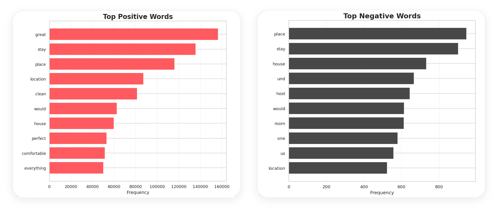
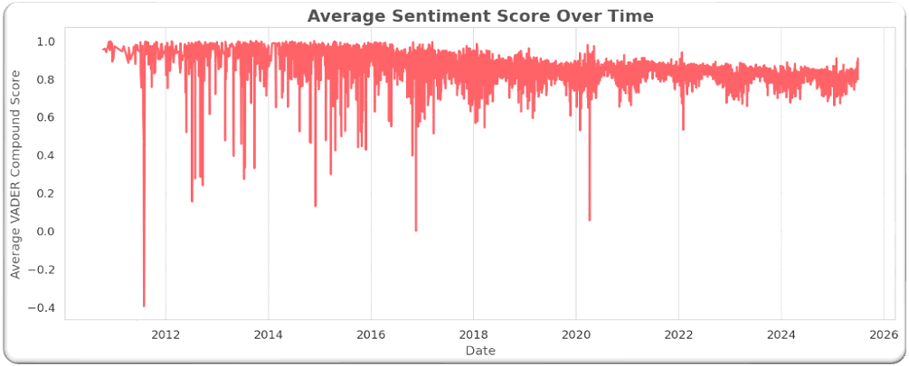
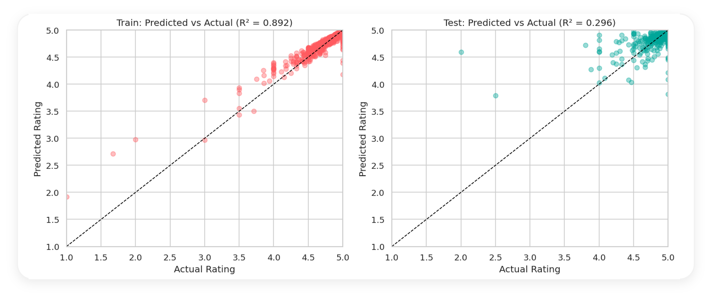

# 🏠 Rhode Island Airbnb - Pricing vs Sentiment Analysis (VADER)

## 🔍 Overview
This project analyzes Airbnb listings in Rhode Island by combining:
- 📌 **Pricing and listing attributes** (structured data)
- 💬 **Guest review text** (unstructured data)

The goal is to quantify guest sentiment using **VADER sentiment scores** and compare **average sentiment across pricing ranges** after cleaning and preparing both datasets.

## ❓ Problem Statement
Airbnb hosts and analysts often ask:
- 💰 Do higher priced listings receive more positive guest sentiment?
- 🧹 What do guests consistently praise or complain about in review text?
- 🏷️ How does sentiment vary by listing segments like room type or superhost status?

This project answers these questions by building review-level sentiment scores, aggregating them to the listing level, and merging them with pricing data for comparison.

## 📂 About the Data
- 🏘️ **Listings dataset**: structured attributes such as price, room type, host information, amenities, location fields.
- 📝 **Reviews dataset**: free-text guest reviews.
- 🧼 Cleaning and preprocessing includes:
  - Converting price to numeric and handling missing values
  - Removing extreme price outliers (top 1 percent) for stable analysis
  - Cleaning review text (HTML removal, whitespace normalization, stopword filtering where applicable)

## 🧰 Techniques Implemented
- 📊 **EDA for pricing and listing attributes**
  - Distribution plots, outlier handling, log price transformation
  - Price range grouping for comparison-ready analysis
- 💬 **Sentiment Analysis using VADER**
  - Built compound sentiment score per review
  - Assigned sentiment labels (Positive, Neutral, Negative)
- 🔗 **Data Aggregation and Joining**
  - Aggregated review sentiment to listing level (average sentiment per listing_id)
  - Joined listing-level sentiment back to listings to compare sentiment vs pricing and other attributes
- ☁️ **Text Insights**
  - Word cloud and frequency analysis for positive and negative reviews to highlight common themes

## 📌 Common Summary Table - Methods and What They Produced

| ✅ Technique | 🧠 What was done | 📈 What we inferred / deduced |
|------------|------------------|------------------------------|
| 📊 Pricing EDA + Outlier Handling | Converted price to numeric, removed top 1 percent outliers, explored distributions and log price | Prevented extreme listings from skewing price comparisons and made pricing trends easier to interpret |
| 💬 VADER Sentiment Scoring | Generated compound sentiment score per review and labeled sentiment | Turned unstructured reviews into measurable sentiment indicators for analysis |
| ☁️ Text Theme Exploration | Word cloud + top positive and negative terms from cleaned review text | Identified common praise and complaint themes that explain sentiment movement |
| 🔗 Aggregation + Merge (listing_id) | Averaged review sentiment per listing and merged with listing attributes and price | Enabled direct comparison of average sentiment by price range and listing segments |

## 📊 Results, Visual Analysis & Key Insights
This section summarizes the key findings derived from combining Airbnb listing prices, structured attributes, and VADER-based sentiment scores from guest reviews.

### 🗣️ Guest Experience Drivers (Text Insights)
Word frequency analysis of VADER-labeled reviews highlights a strong positivity bias across the dataset. Positive reviews are dominated by words such as *great*, *stay*, *place*, *location*, and *clean*, indicating that cleanliness, comfort, and location are the primary drivers of guest satisfaction.  
Negative reviews, although limited in volume, frequently reference *place*, *house*, *room*, *host*, and *stay*, suggesting that dissatisfaction often stems from operational and expectation-related issues rather than isolated service failures.

### 📈 Sentiment Trends Over Time
Average VADER sentiment remains consistently positive over a 14-year period, with occasional sharp dips corresponding to periods of guest dissatisfaction. A gradual upward trend in recent years suggests improvements in listing quality and host professionalism. Notably, sentiment fluctuations often appear **before changes in star ratings**, reinforcing sentiment as an early-warning indicator of potential experience issues.

### 💰 Pricing vs Sentiment Relationship
Across all price ranges, positive sentiment dominates, indicating that **higher prices do not consistently result in higher guest satisfaction**. While premium listings generally maintain strong sentiment, several high-priced listings still show neutral or negative sentiment, signaling potential price–value mismatches. This highlights the importance of aligning pricing strategies with perceived guest experience rather than relying on price alone.

### 🧩 Segment-Level Insights
Clear differences emerge across listing segments:
- **Superhost listings** receive substantially more positive sentiment, validating the Superhost badge as a strong quality and performance signal.
- **Entire home or apartment listings** exhibit the strongest sentiment, while private rooms show relatively higher neutral and negative sentiment, emphasizing the role of privacy, professionalism, and consistency in shaping guest experience.

### ⭐ Forecasting Guest Satisfaction
Forecasting analysis shows strong alignment between predicted and actual ratings on training data, but weaker generalization on test data due to ratings being tightly clustered between 4.5 and 5.0. Despite this limitation, incorporating **average VADER sentiment** improves predictive signal beyond structured listing attributes alone, confirming sentiment as a valuable complementary indicator of guest satisfaction.

### 🔑 Overall Insight
Sentiment analysis provides a reliable, early indicator of guest experience quality. When combined with pricing and listing attributes, it enables proactive detection of operational issues, supports price–value alignment, and helps hosts and platforms improve review stability and customer satisfaction.

# 💼 Business Impact
- 🎯 Helps hosts understand whether pricing aligns with guest satisfaction signals
- 📉 Surfaces operational pain points from negative reviews (actionable quality improvements)
- 🧭 Supports pricing strategy by comparing sentiment across price tiers and segments
- 🧩 Enables segment-level insights (room types, host status) for targeted improvements

## 📌 Key Takeaways
- ✅ VADER provides a fast, interpretable way to quantify guest sentiment at scale
- ✅ Joining review sentiment with listing attributes enables deeper pricing insights
- ✅ Outlier handling is critical for meaningful price-based comparisons
- ✅ Word frequency insights help explain the “why” behind sentiment scores
